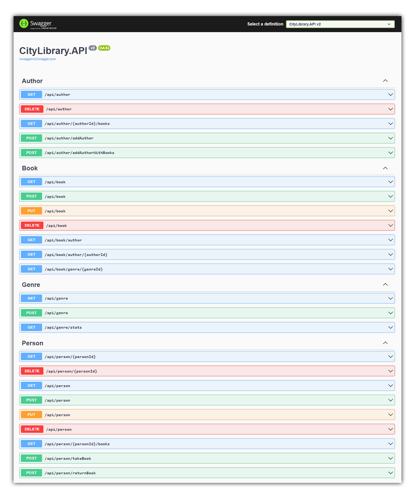

# ASP.NET Core Web API - Backend for City Library

## Версии
- [Первая реализация (v1)](https://github.com/SHILY-PROJECT/CityLibraryApp/tree/feature/Task_3)
- [Текущая реализация (v2)](https://github.com/SHILY-PROJECT/CityLibraryApp)

## Стек
- ASP.NET Core 6.0
- MS SQL Server
- Entity Framework Core
- Automapper
- FluentValidation

## Архитектура
- Onion

## Превью

